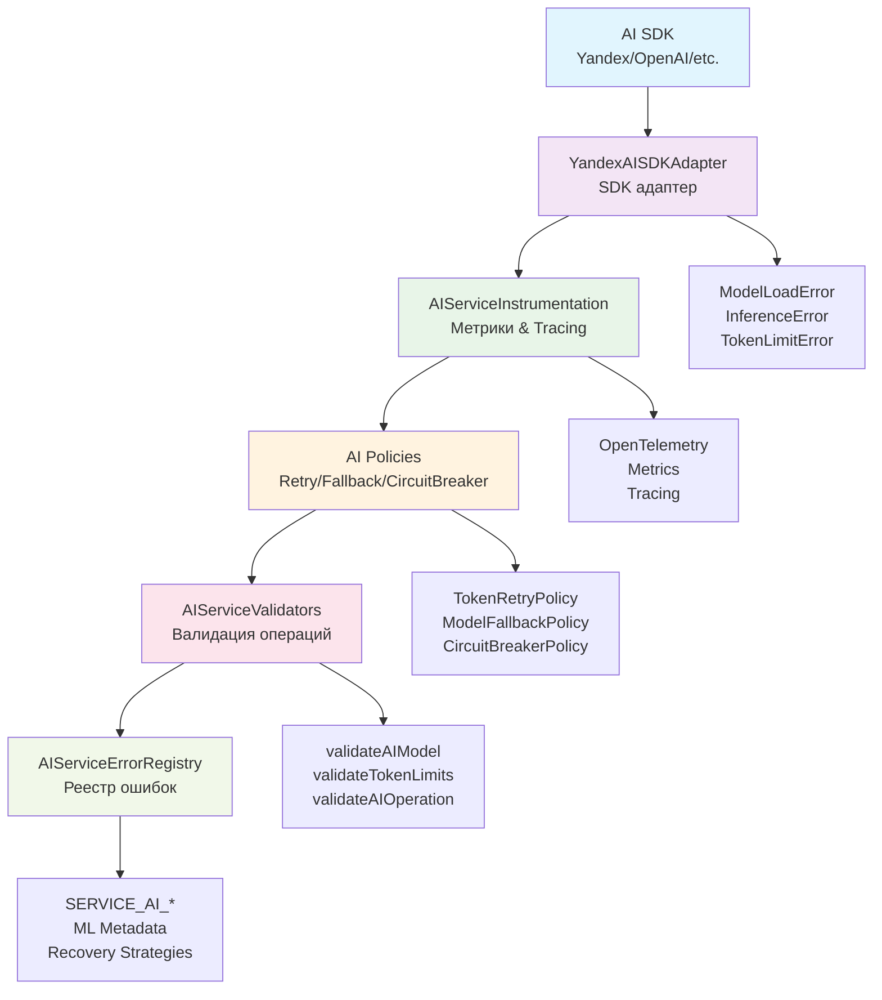

# AI Service Error Layer

Специализированные enterprise-компоненты для обработки ошибок в AI/ML операциях LivAiBot.

## 🎯 Назначение

AI Service слой предоставляет типизированные ошибки, инструментирование и адаптеры для AI/ML операций. Компоненты оптимизированы для работы с внешними AI провайдерами (Yandex Cloud, OpenAI и др.) и обеспечивают production-ready error handling для inference, embedding и moderation операций.

## 🏗️ Архитектура и поток данных



### Поток обработки ошибок:

1. **AI SDK** → Внешний провайдер (Yandex Cloud, OpenAI, etc.)
2. **Adapter** → Преобразование SDK ошибок в типизированные TaggedError
3. **Instrumentation** → Добавление метрик, tracing и observability
4. **Policies** → Применение resilience паттернов (retry, fallback, circuit breaker)
5. **Validators** → Валидация операций и данных
6. **ErrorRegistry** → Централизованное управление кодами ошибок и метаданными

### Типы связей:

- **→** Данные/управление
- **Error Types** Специфические ошибки компонентов
- **Strategies** Recovery и resilience стратегии

## 🧠 AI Error Types

Типизированные ошибки для AI операций с ML-specific контекстом.

### ModelLoadError

Ошибки загрузки и инициализации AI моделей.

```typescript
import { createModelLoadError } from '@livai/core-contracts/errors/ai-service';

const error = createModelLoadError({
  modelId: 'yandexgpt-lite',
  provider: AIProvider.YANDEX,
  loadAttempt: 3,
  details: {
    memoryRequired: 2_000_000_000, // 2GB
    memoryAvailable: 1_500_000_000, // 1.5GB
    gpuRequired: true,
    gpuAvailable: false,
  },
});
// → ModelLoadError с ML контекстом
```

### InferenceError

Ошибки выполнения AI inference операций.

```typescript
import { createInferenceError } from '@livai/core-contracts/errors/ai-service';

const error = createInferenceError({
  operation: 'inference',
  model: 'yandexgpt-lite',
  provider: AIProvider.YANDEX,
  tokenUsage: 150,
  context: {
    prompt: 'User query...',
    temperature: 0.7,
    maxTokens: 1000,
  },
});
// → InferenceError с AI контекстом
```

### TokenLimitError

Превышение лимитов токенов в AI операциях.

```typescript
import { createTokenLimitExceededError } from '@livai/core-contracts/errors/ai-service';

const error = createTokenLimitExceededError({
  model: 'yandexgpt-pro',
  requestedTokens: 2000,
  maxAllowedTokens: 1000,
  provider: AIProvider.YANDEX,
  operation: 'inference',
});
// → TokenLimitError с лимитами
```

## 📊 Instrumentation

Метрики и OpenTelemetry для AI операций.

### AIServiceInstrumentation

Полное инструментирование AI операций с метриками и tracing.

```typescript
import { AIProvider, instrumentAIInference } from '@livai/core-contracts/errors/ai-service';

const context = {
  operation: 'inference' as const,
  model: 'yandexgpt-lite',
  provider: AIProvider.YANDEX,
  errorAttributes: {
    customErrorCode: 500,
    retryCount: 2,
  },
};

const instrumentedEffect = instrumentAIInference(
  context,
  aiInferenceEffect, // ваш Effect с AI операцией
);
// → Автоматические метрики, tracing и error handling
```

### Metrics System

Встроенные метрики для AI операций с унифицированными атрибутами.

```typescript
// Метрики собираются автоматически:
// - ai_inference_tokens: использование токенов
// - ai_inference_errors_total: счетчик ошибок
// - ai_inference_success_total: счетчик успешных операций
// - ai_inference_duration: время выполнения

// Унифицированные атрибуты метрик:
interface AIMetricAttributes {
  model: string; // Название модели
  provider: string; // Провайдер (yandex/local/external)
  operation: string; // Тип операции (inference/embedding/moderation)
  errorTag?: string; // Тип ошибки для классификации
  retryCount?: number; // Количество повторных попыток
  customErrorCode?: number; // Кастомный код ошибки
  gpuRequired?: boolean; // Требуется ли GPU
  modelType?: string; // Тип модели (text/classification/etc)
  tokenCount?: number; // Количество токенов
  latencyMs?: number; // Задержка в миллисекундах
}
```

## 🔌 AI Adapters

Effect-based адаптеры для AI провайдеров.

### YandexAISDKAdapter

Интеграция с Yandex Cloud AI SDK.

```typescript
import { yandexAISDKAdapter } from '@livai/core-contracts/errors/ai-service';

const result = await yandexAISDKAdapter.complete({
  prompt: 'Hello, how are you?',
  temperature: 0.7,
  maxTokens: 100,
  model: 'yandexgpt-lite',
});
// → Effect с автоматической обработкой ошибок Yandex API
```

## ✅ Validation

Комплексная валидация AI операций и моделей.

### AIModel Validation

Проверка доступности и совместимости моделей.

```typescript
import { validateAIModel } from '@livai/core-contracts/errors/ai-service';

const validation = validateAIModel({
  model: 'yandexgpt-lite',
  provider: AIProvider.YANDEX,
  task: 'text-generation',
  contextSize: 2048,
});
// → Валидация модели и провайдера
```

### Token Limits Validation

Проверка токенов с safety buffer.

```typescript
import { validateTokenLimits } from '@livai/core-contracts/errors/ai-service';

const validation = validateTokenLimits({
  requestedTokens: 1000,
  modelLimits: { maxTokens: 2048 },
  safetyBuffer: 100,
});
// → Проверка лимитов с запасом
```

## 🔄 AI Policies

Специализированные политики для AI операций.

### Token Retry Policy

Повторные попытки с учетом токенов.

```typescript
import { createTokenRetryPolicy } from '@livai/core-contracts/errors/ai-service';

const policy = createTokenRetryPolicy({
  maxAttempts: 3,
  tokenMultiplier: 0.8, // уменьшать токены при retry
  backoffMs: 1000,
});

const resilientEffect = withRetryPolicy(policy)(aiEffect);
```

### Model Fallback Policy

Переключение на альтернативные модели.

```typescript
import { createModelFallbackPolicy } from '@livai/core-contracts/errors/ai-service';

const policy = createModelFallbackPolicy({
  fallbackModels: ['yandexgpt-lite', 'yandexgpt-pro'],
  preserveTemperature: true,
});

const fallbackEffect = withFallbackPolicy(policy)(aiEffect);
```

## 📋 Serialization

Сериализация результатов AI операций.

### AIResultSerializer

Форматирование результатов для разных протоколов.

```typescript
import { createAIResultSerializer } from '@livai/core-contracts/errors/ai-service';

const serializer = createAIResultSerializer({
  format: 'grpc',
  includeMetadata: true,
});

const serialized = serializer.serialize(aiResult);
// → Сериализованный результат для gRPC/HTTP
```

## 🔍 Error Registry

Централизованный реестр AI ошибок с метаданными.

```typescript
import {
  AI_SERVICE_ERROR_CODES,
  getAIServiceErrorMeta,
} from '@livai/core-contracts/errors/ai-service';

// Получить метаданные ошибки
const meta = getAIServiceErrorMeta('SERVICE_AI_001');
// → ML-specific метаданные (modelType, tokenCosts, etc.)

// Все доступные коды ошибок
console.log(AI_SERVICE_ERROR_CODES);
// → SERVICE_AI_001, SERVICE_AI_002, ...
```

## 📖 Для кого

- **AI/ML инженеры**: Специфические компоненты для AI операций
- **Backend разработчики**: Интеграция с AI сервисами
- **DevOps инженеры**: Мониторинг и resilience AI систем
- **QA инженеры**: Тестирование AI error scenarios

## 🔗 Связанные компоненты

- **[Base Layer](../base/)**: Foundation примитивы
- **[Shared Layer](../shared/)**: Общие компоненты
- **[Error System Overview](../README.md)**: Полная архитектура
- **[Usage Examples](../../../docs/USAGE.md)**: Практические примеры
