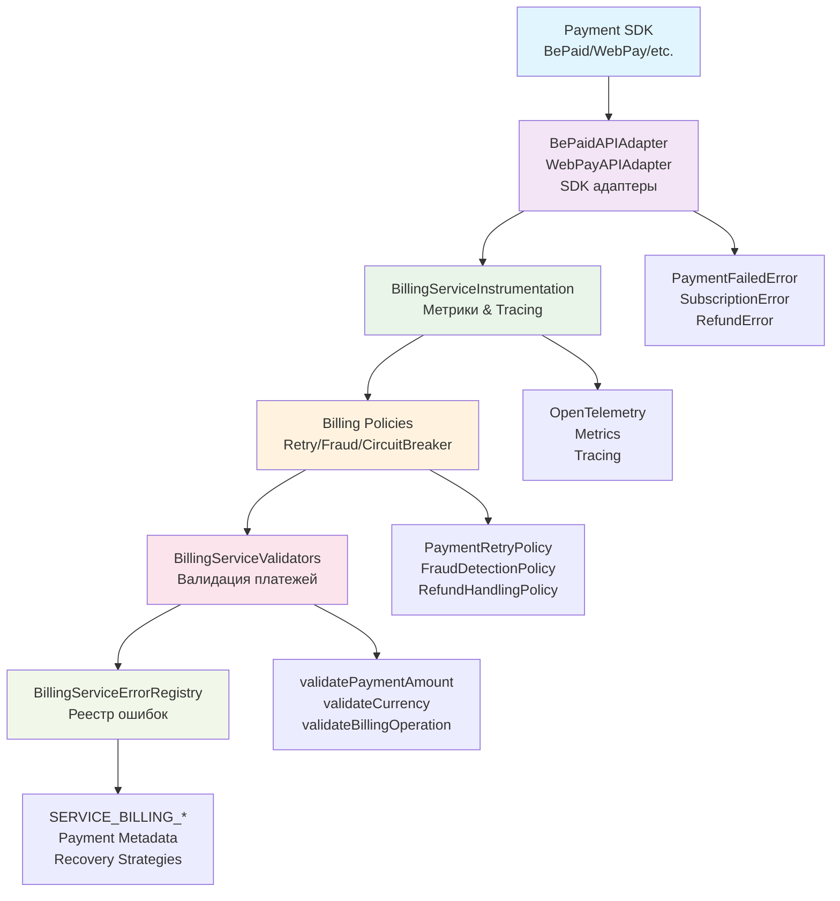

# Billing Service Error Layer

Специализированные enterprise-компоненты для обработки ошибок в платежных операциях LivAiBot.

## 🎯 Назначение

Billing Service слой предоставляет типизированные ошибки, инструментирование и адаптеры для платежных операций. Компоненты оптимизированы для работы с внешними платежными провайдерами (BePaid, WebPay и др.) и обеспечивают production-ready error handling для payment, subscription и refund операций с полной PCI DSS compliance.

## 🏗️ Архитектура и поток данных



### Поток обработки ошибок:

1. **Payment SDK** → Внешний платежный провайдер (BePaid, WebPay, etc.)
2. **Adapter** → Преобразование SDK ошибок в типизированные TaggedError
3. **Instrumentation** → Добавление метрик, tracing и observability
4. **Policies** → Применение resilience паттернов (retry, fraud detection, circuit breaker)
5. **Validators** → Валидация платежей и данных
6. **ErrorRegistry** → Централизованное управление кодами ошибок и метаданными

### Типы связей:

- **→** Данные/управление
- **Error Types** Специфические ошибки компонентов
- **Strategies** Recovery и resilience стратегии

## 💳 Billing Error Types

Типизированные ошибки для платежных операций с PCI-safe контекстом.

### PaymentFailedError

Ошибки неудачных платежных операций.

```typescript
import { createPaymentFailedError } from '@livai/core-contracts/errors/billing-service';

const error = createPaymentFailedError(
  'txn-123456',
  1000, // amount in minor units (kopeks)
  'BYN', // currency
  {
    provider: 'bepaid',
    operation: 'purchase',
    retryPolicy: 'delayed',
  },
);
// → PaymentFailedError с PCI-safe контекстом
```

### SubscriptionError

Ошибки управления подписками и лимитами.

```typescript
import { createSubscriptionError } from '@livai/core-contracts/errors/billing-service';

const error = createSubscriptionError(
  'sub-789',
  'Usage limit exceeded for plan PRO',
  {
    planId: 'plan-pro',
    currentUsage: 150,
    allowedUsage: 100,
  },
);
// → SubscriptionError с бизнес-контекстом
```

### RefundError

Ошибки обработки возвратов средств.

```typescript
import { createRefundError } from '@livai/core-contracts/errors/billing-service';

const error = createRefundError(
  'txn-123456',
  'Refund period expired',
  {
    refundAmount: 500,
    currency: 'BYN',
    daysSinceTransaction: 35,
  },
);
// → RefundError с compliance контекстом
```

## 📊 Instrumentation

Метрики и OpenTelemetry для платежных операций.

### BillingServiceInstrumentation

Полное инструментирование платежных операций с метриками и tracing.

```typescript
import { instrumentPaymentOperation } from '@livai/core-contracts/errors/billing-service';

const context = {
  operation: 'payment' as const,
  provider: 'bepaid',
  currency: 'BYN',
  amount: 1000,
  errorAttributes: {
    customErrorCode: 402,
    retryCount: 1,
  },
};

const instrumentedEffect = instrumentPaymentOperation(
  context,
  paymentEffect, // ваш Effect с платежной операцией
);
// → Автоматические метрики, tracing и error handling
```

### Metrics System

Встроенные метрики для платежных операций с унифицированными атрибутами.

```typescript
// Метрики собираются автоматически:
// - billing_payment_amount_total: суммы платежей
// - billing_payment_errors_total: счетчик ошибок платежей
// - billing_payment_success_total: счетчик успешных платежей
// - billing_payment_duration: время выполнения платежей

// Унифицированные атрибуты метрик:
interface BillingMetricAttributes {
  provider: string; // Провайдер (bepaid/webpay/etc)
  operation: string; // Тип операции (payment/subscription/refund)
  currency: string; // Валюта платежа
  amount?: number; // Сумма в minor units
  errorTag?: string; // Тип ошибки для классификации
  retryCount?: number; // Количество повторных попыток
  fraudRisk?: 'low' | 'medium' | 'high'; // Уровень риска мошенничества
  regionId?: string; // Регион операции
  tenantId?: string; // Tenant/organization
}
```

## 🔌 Payment Adapters

Effect-based адаптеры для платежных провайдеров.

### BePaidAPIAdapter

Интеграция с BePaid платежным агрегатором.

```typescript
import { bePaidAdapter } from '@livai/core-contracts/errors/billing-service';

const result = await bePaidAdapter.createPayment({
  amount: 1000, // 10.00 BYN
  currency: 'BYN',
  orderId: 'order-123',
  paymentMethod: 'credit_card',
});
// → Effect с автоматической обработкой ошибок BePaid API
```

### WebPayAPIAdapter

Интеграция с WebPay платежной системой.

```typescript
import { webPayAdapter } from '@livai/core-contracts/errors/billing-service';

const result = await webPayAdapter.getPaymentStatus('txn-123');
// → Effect с автоматической обработкой ошибок WebPay API
```

## ✅ Validation

Комплексная валидация платежных операций.

### Payment Amount Validation

Проверка сумм платежей с учетом валют и лимитов.

```typescript
import { validatePaymentAmount } from '@livai/core-contracts/errors/billing-service';

const validation = validatePaymentAmount({
  amount: 1000,
  currency: 'BYN',
  context: {
    operation: 'payment',
    provider: 'bepaid',
  },
});
// → Валидация суммы с учетом валютных лимитов
```

### Currency Support Validation

Проверка поддержки валют.

```typescript
import { isCurrencySupported } from '@livai/core-contracts/errors/billing-service';

const supported = isCurrencySupported('BYN'); // → true
const supportedEUR = isCurrencySupported('EUR'); // → true
const unsupported = isCurrencySupported('XYZ'); // → false
```

### PCI Compliance Validation

Валидация соответствия PCI DSS требованиям.

```typescript
import { validatePCICompliance } from '@livai/core-contracts/errors/billing-service';

const validation = validatePCICompliance({
  operation: 'payment',
  data: paymentData,
  context: {
    provider: 'bepaid',
    hasSensitiveData: false,
  },
});
// → PCI compliance проверка
```

## 🔄 Billing Policies

Специализированные политики для платежных операций.

### Payment Retry Policy

Повторные попытки платежей с учетом бизнес-логики.

```typescript
import { createPaymentRetryPolicy } from '@livai/core-contracts/errors/billing-service';

const policy = createPaymentRetryPolicy({
  maxAttempts: 3,
  amountThreshold: 5000, // не retry для сумм > 50 BYN
  backoffMs: 2000,
  currencySensitive: true,
});

const resilientEffect = withRetryPolicy(policy)(paymentEffect);
```

### Fraud Detection Policy

Обнаружение мошеннических платежей.

```typescript
import { createFraudDetectionPolicy } from '@livai/core-contracts/errors/billing-service';

const policy = createFraudDetectionPolicy({
  riskThreshold: 'medium',
  blockHighRisk: true,
  externalProviders: ['provider1', 'provider2'],
});

const secureEffect = withFraudDetection(policy)(paymentEffect);
```

### Refund Handling Policy

Политики обработки возвратов.

```typescript
import { createRefundHandlingPolicy } from '@livai/core-contracts/errors/billing-service';

const policy = createRefundHandlingPolicy({
  maxRefundPeriodDays: 30,
  requireApproval: true,
  duplicatePrevention: true,
});

const compliantEffect = withRefundPolicy(policy)(refundEffect);
```

## 📋 Serialization

Сериализация результатов платежных операций.

### PaymentResultSerializer

Форматирование результатов для разных протоколов.

```typescript
import { createPaymentResultSerializer } from '@livai/core-contracts/errors/billing-service';

const serializer = createPaymentResultSerializer({
  format: 'grpc',
  includeMetadata: true,
  maskSensitive: true,
});

const serialized = serializer.serialize(paymentResult);
// → Сериализованный результат для gRPC/HTTP
```

### PaymentErrorSerializer

Сериализация ошибок платежей с PCI compliance.

```typescript
import { createPaymentErrorSerializer } from '@livai/core-contracts/errors/billing-service';

const serializer = createPaymentErrorSerializer({
  format: 'json',
  complianceLevel: 'pci',
  maskSensitive: true,
});

const serializedError = serializer.serialize(paymentError);
// → PCI-safe сериализация ошибки
```

## 🔍 Error Registry

Централизованный реестр платежных ошибок с метаданными.

```typescript
import {
  BILLING_SERVICE_ERROR_REGISTRY,
  getBillingErrorMetadata,
} from '@livai/core-contracts/errors/billing-service';

// Получить метаданные ошибки
const meta = getBillingErrorMetadata('SERVICE_BILLING_PAYMENT_FAILED');
// → Payment-specific метаданные (refundable, retryable, fraudRisk, etc.)

// Все доступные коды ошибок
console.log(Object.keys(BILLING_SERVICE_ERROR_REGISTRY));
// → SERVICE_BILLING_PAYMENT_FAILED, SERVICE_BILLING_SUBSCRIPTION_ERROR, ...
```

## 📖 Для кого

- **Payment инженеры**: Специфические компоненты для платежных операций
- **Backend разработчики**: Интеграция с платежными системами
- **DevOps инженеры**: Мониторинг и resilience платежных систем
- **Compliance офицеры**: PCI DSS и регуляторные требования
- **QA инженеры**: Тестирование payment error scenarios

## 🔗 Связанные компоненты

- **[Base Layer](../base/)**: Foundation примитивы
- **[Shared Layer](../shared/)**: Общие компоненты
- **[Error System Overview](../README.md)**: Полная архитектура
- **[Usage Examples](../../../docs/USAGE.md)**: Практические примеры
